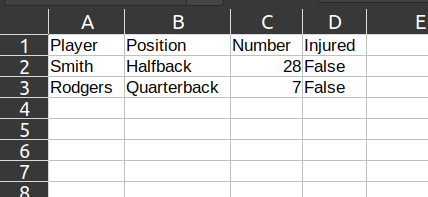
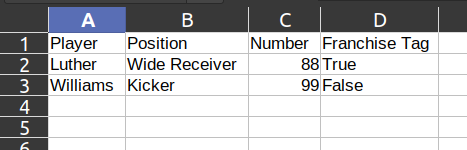
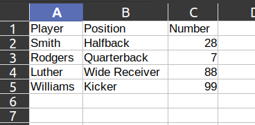

## csv_stacker

A simple binary utility to vertically stack a bunch of CSV files with partially matching column headers.

### Configuration
Can be configured using Config.toml to define 3 parameters:
1. csv_dir_path: the path to the directory where the csvs you want to stack are held.
2. outfile: the filename to write the stacked csv out to.
3. colnames: a list of column headers you want to select for in the stacked csv file.

### Usage
I use this to aggregate individual stock trading transaction logs into a single combined csv history file.

### Example

Say you have two CSV files, "foo.csv" and "bar.csv" in a relative dirctory named "csvs".

foo.csv

bar.csv

You can use the following configuration toml file to stack these csvs into "stacked.csv".

Config.toml

    csv_dir_path = "csvs"
    outfile = "stacked.csv"
    colnames = [
    "Player",
    "Position",
    "Number",
    ]

Running the binary will result in the following combined csv file "stacked.csv".

stacked.csv

